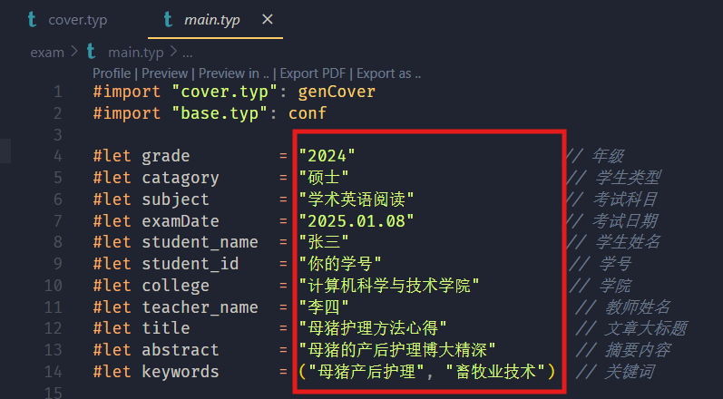
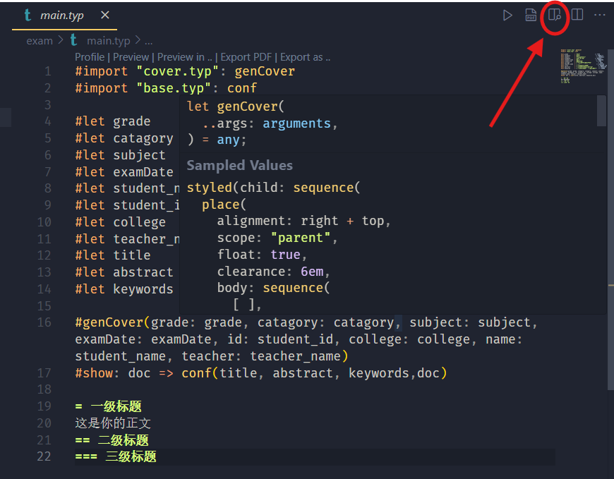
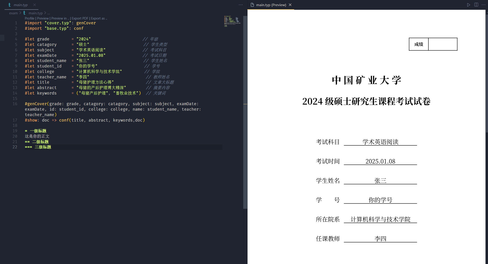
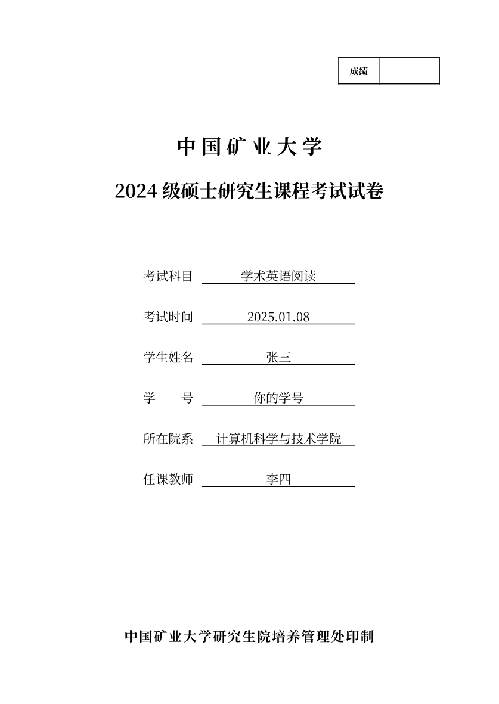
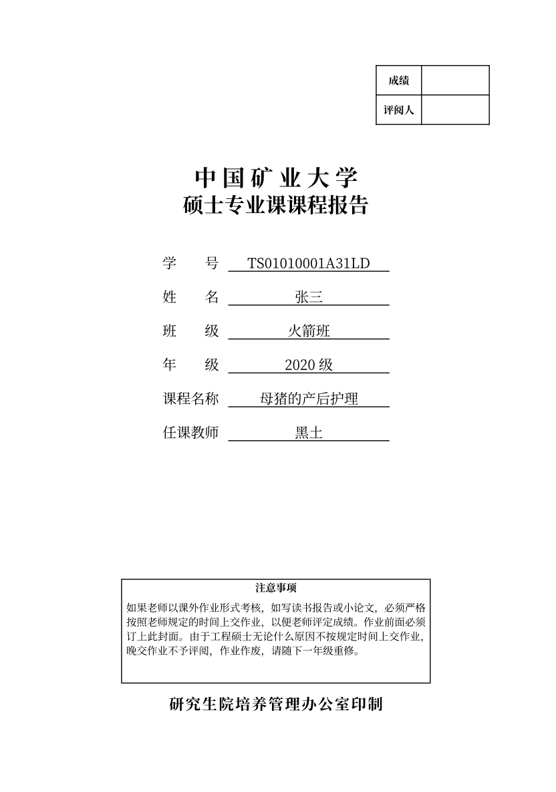

# 中国矿业大学课程作业模板

这是中国矿业大学一些课程作业的模板，目前更新[Typst](https://typst.app/)模板，现有《中国矿业大学硕士专业课课程报告》和《中国矿业大学硕士研究生课程考试试卷》两种模板在库中。后续可能会有Latex模板（永远不会更新word模板，I extremely hate it!）。如果你想要其它模板，请向我发邮件✉️fatdcheng@gmail.com，如果相关需求比较多的话，可能会写一写。欢迎大家提交自己写的模板！赠人模板，手有余香！🌹

## 使用方法

> 不推荐使用web app进行编辑，本库使用的中文字体是Adobe思源字体([点击下载](https://github.com/adobe-fonts/source-han-sans/blob/master/README-CN.md))，你需要在web app上传字体，但是web app对上传的文件大小有限制，因此还是本地开发的好。

1. 在[Typst Github Release](https://github.com/typst/typst/releases/)页面下载你的系统对应的Typst (笔者的版本是typst 0.12.0 (737895d7)) 进行安装，并设置好PATH变量。
2. 下载并安装[Visual Studio Code](https://code.visualstudio.com/)，`Ctrl + Shift + X`安装`Tinymist Typst`插件，插件支持语法高亮和分窗口实时预览等功能。
3. 安装[Git](https://git-scm.com/downloads)，拉取库，使用VS Code打开库的目录
```bash
git clone https://github.com/Ftdcheng/CUMTAssignmentTemplates.git
code CUMTAssignmentTemplates # 使用vs code打开项目目录
```
4. 《中国矿业大学硕士专业课课程报告》由`report`目录下三个文件构成，《中国矿业大学硕士研究生课程考试试卷》由`exam`目录下三个文件构成。`exam`和`report`目录下`base.typ`存放基础配置，`cover.typ`存放封面，`main.typ`存放主要页面内容。一般只需修改`main.typ`，你需要修改的字段已经为你在文档中进行了注释。

5. VS Code中点击`exam/main.typ`，然后再点击右上角的预览按钮即可分屏实时预览，你在左侧编辑可以实时对应到右边的预览框。



## 排版效果展示



## 参考与问题报告
Typst是排版软件的新起之秀，**优美的语法和惊人的速度**是它最大的优点。`Word`在排版大规模高度格式化的文本（例如论文）排版中有先天的劣势，浪费人的寿命。$\LaTeX$虽然可以进行高质量的排版，但是使用体验不是那么好，它的语法比较丑陋，编译速度很慢，报错信息很难看，调试起来很困难。使用Typst有足够的理由！然而请注意：**Typst比较新，出了问题你可能不能马上找到答案，你可能需要求助于社区。这些链接可能对你有帮助**：

* [Typst中文社区导航](https://typst-doc-cn.github.io/guide/)
* [Typst中文用户指南](https://typst-doc-cn.github.io/docs/chinese/)
* [Typst官方文档与教程(英文)](https://typst.app/docs)

虽然现在Typst有这样的问题，但是有理由相信Typst会越来越好，生态越来越丰富，你能白嫖的模板越来越多！😋（前提是你得敢于学习使用和安利周围的人使用）

欢迎提交Issue！

## 许可证

本项目使用MIT许可证。详情请参阅[LICENSE](./LICENSE)文件。